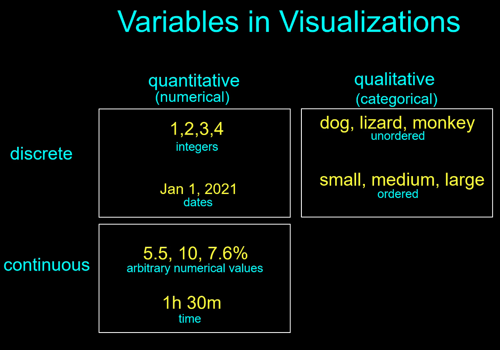
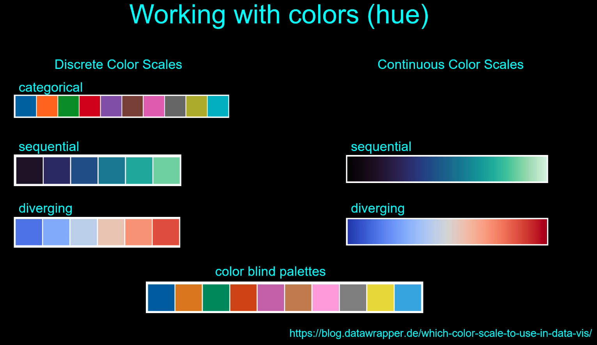
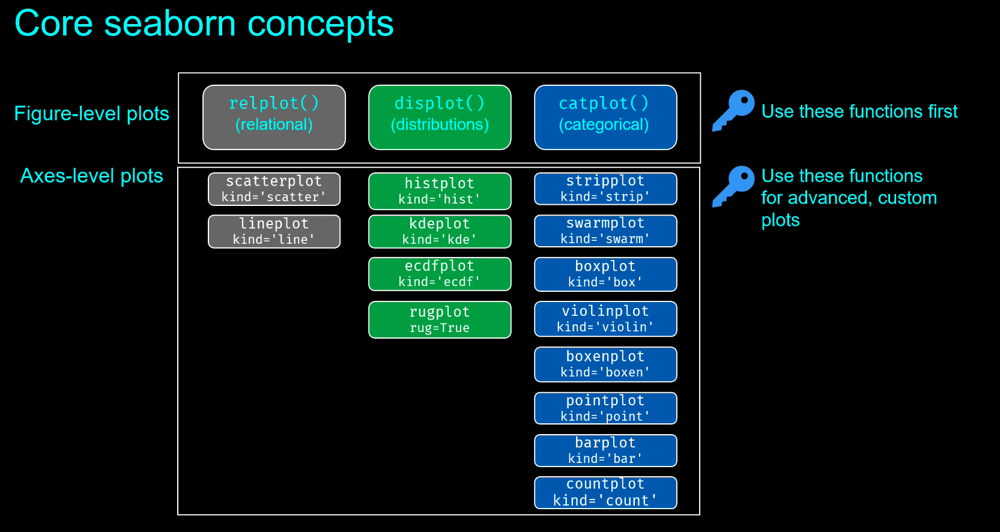

# Data Visualization
**Aesthetics** refers to position, shape, size, color, line width and type, etc.

### Variables in Vizzes

### Color scales

## Matplotlib
**Figures are containers for axes**

## Seaborn
